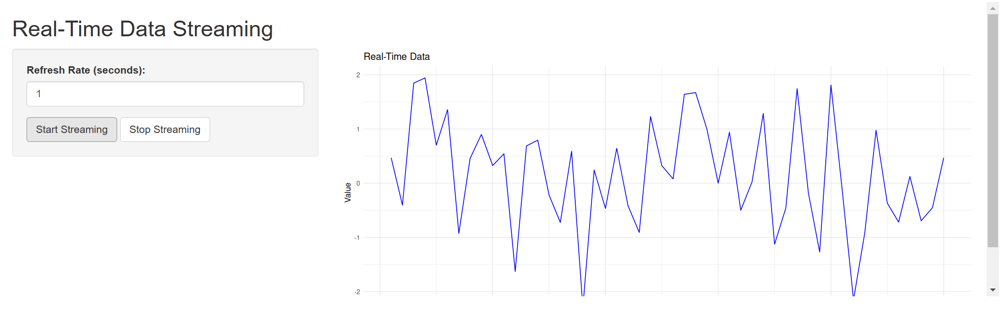

# Hello My Shiny-Azu-R-App

## Overview

After a good thanksgiving dinner I was enjoying the good company of my family, and relative asked me if I new anything about Shiny Apps in Azure? Now, there's a joke laying around somewhere if someone could pick that up before someone falls over it.

At any rate, it sparked my attention because I like shiny things and I love shiny things in Azure.

So when I woke the next morning I took a few hours to see what I was missing out on.

## What  is  Shiny

Shiny is a framework that allows data scientists to develop quick and easy web sites so that you don't have to pay a full stack team of people JUST to deliver the value from you data folks. Essentially they can do it themselves - the Azure stuff might trip them up.

Shiny Apps support Python & R. My relative was using R so that's what I focused on.

## Getting Start
1. Clone the repository
2. Run `docker-compose build && docker-compose up -d`
3. Navigate to http://localhost:3838/

If you run into any problems you can view your docker logs

```
docker exec -it shiny-hello-world dir var/log/shiny-server
docker exec -it shiny-hello-world cat var/log/shiny-server/shiny-server-shiny-XXXX-XXX-XXX.log
```

## Deploying to Azure

For the sake of  brevity I decided to use a Linux App Service for  containers instead of k8s. You can refer to the `scripts/deploy.sh` as it is pretty well documented. 

You should then be able click your link and it will take you to your site.


## Spoiler
If your web site loads but you get an error stream the logs:
```
az webapp log tail --name shiny-azure-webapp-XXX --resource-group shiny-azure-app-XXX-rg
```
You can do this in VSCode Terminal, Terminal or Cloud Shell. There is also a Log Stream blade in azure you can use.

I did run into some problems that more or less came down to dependencies that I hadn't installed in the container image. I found these errors by streaming my logs.

Once I saw I was missing dependencies the solution was this line in the Dockerfile:

```
# Install shiny package
RUN R -e "install.packages(c('shiny', 'ggplot2', 'dplyr'), repos='https://cloud.r-project.org/')"
```
